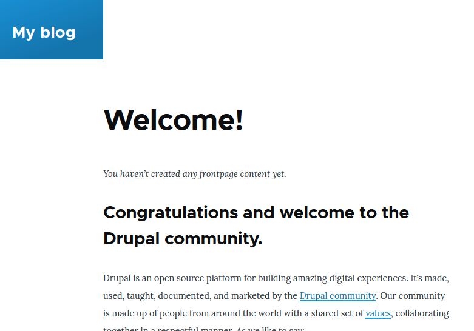

# Deploy Instance

## Intention
In this part of the lab, we're going to deploy a first ec2 instance on our private subnet.

In order to respect the constraints of our infrastructure, we'll need to modify certain elements of our instance so that we can access it via ssh as well as via the web browser.

### Prerequisites

* Retrieve the private key dedicated to the Drupal machine delivered in your private team channel (folder AWS).
* Study the [AWS CLI documentation to identify the constraints to be met before we can deploy our Drupal instance](https://awscli.amazonaws.com/v2/documentation/api/latest/reference/ec2/run-instances.html).
* Refer to our infrastructure schema to understand how we can expose/access our application.


---

### Task 01 - Network settings

* [Create your subnet](https://awscli.amazonaws.com/v2/documentation/api/latest/reference/ec2/create-subnet.html)

|Key|Value|
|:--|:--|
|Name|SUB-PRIVATE-DEVOPSTEAM<XX>|
|Vpc-id|vpc-03d46c285a2af77ba|
|IPv4 CIDR block|10.0.<XX>.0/28|
|Availability Zone|eu-west-3a|

* [Create your route table](https://awscli.amazonaws.com/v2/documentation/api/latest/reference/ec2/create-route-table.html)

|Key|Value|
|:--|:--|
|Name|RTBLE-PRIVATE-DRUPAL-DEVOPSTEAM<XX>|
|Subnet Association|With your private subnet|

* [Create your routes](https://awscli.amazonaws.com/v2/documentation/api/latest/reference/ec2/create-route.html)

Note : Refer to the infra schema to add.

---

### Task 02 - Instance settings

* [Create your key pair](https://awscli.amazonaws.com/v2/documentation/api/latest/reference/ec2/create-key-pair.html)

Note : already done (team channel -> files/aws)

* [Create your security group](https://docs.aws.amazon.com/cli/latest/userguide/cli-services-ec2-sg.html)

|Key|Value|
|:--|:--|
|Name|SG-PRIVATE-DRUPAL-DEVOPSTEAM<xx>|
|Inbound rules|Refer to infra schema|
|Outbound rules|Refer to infra schema|

* Update the NAT Security group

Note : Refer to the infra schema to add mandatory inbound rules for your subnet.

---

### Task 03 - Deploy Bitnami/Drupal Instance

* [Launch your instance](https://docs.aws.amazon.com/cli/latest/userguide/cli-services-ec2-instances.html)

|Key|Value|
|:--|:--|
|Name|EC2_PRIVATE_DRUPAL_DEVOPSTEAM<XX>|
|AMI|ami-00b3a1b7cfab20134|
|Subnet|your private subnet|
|Key|your key|
|Instance type|t3.micro|
|Storage|1x10 Go gp2|

* [Get official doc](https://bitnami.com/support/aws)

---

### Task 04 - SSH Access to your private Drupal Instance

* Update your ssh string connection adding a ssh tunnel to your Drupal instance

```bash
[your connection string] -L <localPortToForward>:<privateIpOfYouDrupal>:22

//Sample
ssh devopsteam<xx>@15.188.43.46 -i CLD_KEY_DMZ_DEVOPSTEAM<xx>.pem -L 2223:10.0.<xx>.10:22
```

* Create the connection string to your drupal instance

```
<user>@localhost -i <pathToYourDrupalSSHKey>

//Sample
ssh bitnami@localhost -p 2223 -i CLD_KEY_DRUPAL_DEVOPSTEAM<xx>.pem
```

* Renew your ssh connection first, then launch a second ssh session for your Drupal instance

* Result expected

```
Linux ip-10-0-<xx>-10 5.10.0-28-cloud-amd64 #1 SMP Debian 5.10.209-2 (2024-01-31) x86_64

The programs included with the Debian GNU/Linux system are free software;
the exact distribution terms for each program are described in the
individual files in /usr/share/doc/*/copyright.

Debian GNU/Linux comes with ABSOLUTELY NO WARRANTY, to the extent
permitted by applicable law.
       ___ _ _                   _
      | _ |_) |_ _ _  __ _ _ __ (_)
      | _ \ |  _| ' \/ _` | '  \| |
      |___/_|\__|_|_|\__,_|_|_|_|_|

  *** Welcome to the Bitnami package for Drupal 10.2.3-1        ***
  *** Documentation:  https://docs.bitnami.com/aws/apps/drupal/ ***
  ***                 https://docs.bitnami.com/aws/             ***
  *** Bitnami Forums: https://github.com/bitnami/vms/           ***
Last login: Wed Mar  6 18:43:11 2024 from 10.0.0.5
```

---

### Task 05 - Web access to your private Drupal Instance

#### INSIDE THE SUBNET

* Test directly on the ssh srv (inside the private subnet)

```
[INPUT]
curl localhost

[OUTPUT]
you get the html content of the home page
```

* Change the default port of apache

```
file : /opt/bitnami/apache2/conf/httpd.conf
LISTEN 8080
```

```
file : /opt/bitnami/apache2/conf/bitnami/bitnami.conf
<VirtualHost _default_:8080>
```

```
file : /opt/bitnami/apache2/conf/vhosts/drupal-vhost.conf
<VirtualHost 127.0.0.1:8080 _default_:8080>
```

* Restart Apache Server

```
sudo /opt/bitnami/ctlscript.sh restart apache
```

#### FROM THE DMZ

* Test directly on the ssh srv (outside the private subnet)

```
[INPUT]
curl 10.0.<XX>.10:8080

[OUTPUT]
you get the html content of the home page
```

#### FROM THE WEB (THROUGH SSH)

* Update your ssh string connection adding a http tunnel to your Drupal instance

```bash
[your connection string] -L <localPortToForward>:<privateIpOfYouDrupal>:22

//Sample
ssh devopsteam<xx>@15.188.43.46 -i CLD_KEY_DMZ_DEVOPSTEAM<xx>.pem -L 2223:10.0.<xx>.10:22 -L 888:10.0.<xx>.10:8080
```

* Test directly on your localhost, using your browser


