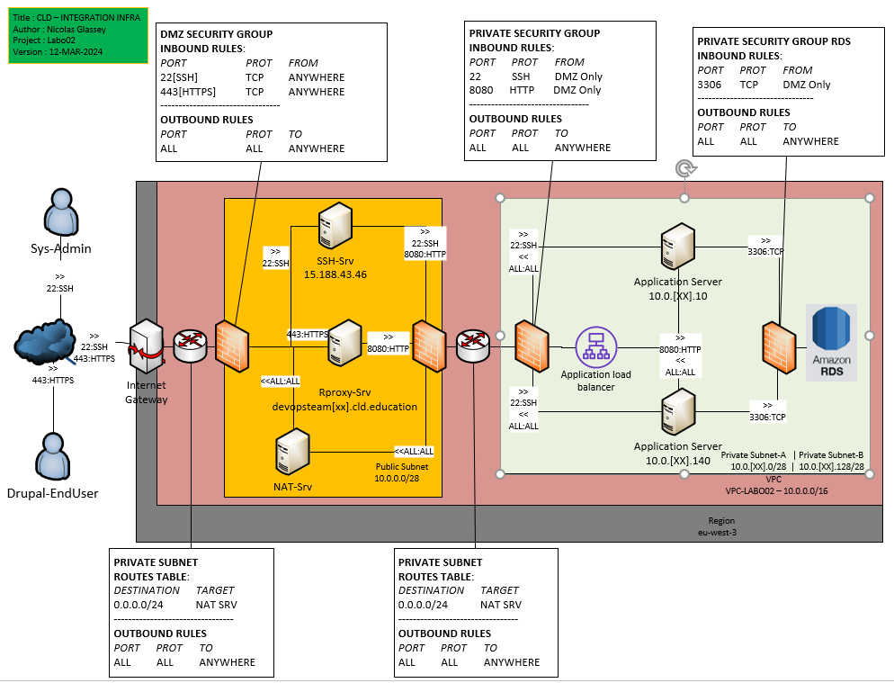

### Deploy the elastic load balancer

In this task you will create a load balancer in AWS that will receive
the HTTP requests from clients and forward them to the Drupal
instances.



## Task 01 Prerequisites for the ELB

* Create a dedicated security group

|Key|Value|
|:--|:--|
|Name|SG-DEVOPSTEAM[XX]-LB|
|Inbound Rules|Application Load Balancer|
|Outbound Rules|Refer to the infra schema|

```bash
[INPUT]


[OUTPUT]

```

* Create the Target Group

|Key|Value|
|:--|:--|
|Target type|Instances|
|Name|TG-DEVOPSTEAM[XX]|
|Protocol and port|Refer to the infra schema|
|Ip Address type|IPv4|
|VPC|Refer to the infra schema|
|Protocol version|HTTP1|
|Health check protocol|HTTP|
|Health check path|/|
|Port|Traffic port|
|Healthy threshold|2 consecutive health check successes|
|Unhealthy threshold|2 consecutive health check failures|
|Timeout|5 seconds|
|Interval|10 seconds|
|Success codes|200|

```bash
[INPUT]


[OUTPUT]

```


## Task 02 Deploy the Load Balancer

[Source](https://aws.amazon.com/elasticloadbalancing/)

* Create the Load Balancer

|Key|Value|
|:--|:--|
|Type|Application Load Balancer|
|Name|ELB-DEVOPSTEAM99|
|Scheme|Internal|
|Ip Address type|IPv4|
|VPC|Refer to the infra schema|
|Security group|Refer to the infra schema|
|Listeners Protocol and port|Refer to the infra schema|
|Target group|Your own target group created in task 01|

Provide the following answers (leave any
field not mentioned at its default value):

```bash
[INPUT]


[OUTPUT]

```

* Get the ELB FQDN (DNS NAME - A Record)

```bash
[INPUT]


[OUTPUT]

```

* Get the ELB deployment status

Note : In the EC2 console select the Target Group. In the
       lower half of the panel, click on the **Targets** tab. Watch the
       status of the instance go from **unused** to **initial**.

* Ask the DMZ administrator to register your ELB with the reverse proxy via the private teams channel

* Update your string connection to test your ELB and test it

```bash
//connection string updated
```

* Test your application through your ssh tunneling

```bash
[INPUT]
curl localhost:[local port forwarded]

[OUTPUT]

```

#### Questions - Analysis

* On your local machine resolve the DNS name of the load balancer into
  an IP address using the `nslookup` command (works on Linux, macOS and Windows). Write
  the DNS name and the resolved IP Address(es) into the report.

```
//TODO
```

* From your Drupal instance, identify the ip from which requests are sent by the Load Balancer.

Help : execute `tcpdump port 8080`

```
//TODO
```

* In the Apache access log identify the health check accesses from the
  load balancer and copy some samples into the report.

```
//TODO
```
