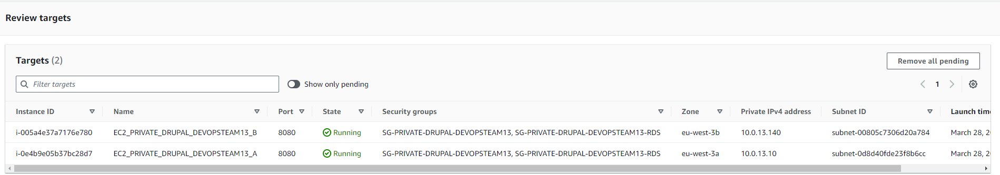
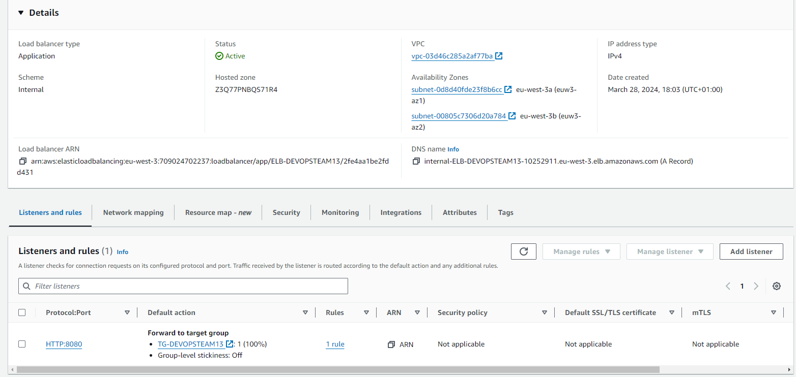

### Deploy the elastic load balancer

In this task you will create a load balancer in AWS that will receive
the HTTP requests from clients and forward them to the Drupal
instances.


## Task 01 Prerequisites for the ELB

* Create a dedicated security group

|Key|Value|
|:--|:--|
|Name|SG-DEVOPSTEAM13-LB|
|Inbound Rules|Application Load Balancer|
|Outbound Rules|Refer to the infra schema|

```bash
[INPUT]
aws ec2 create-security-group \
    --group-name SG-DEVOPSTEAM13-LB \
    --description "Allow load balancer traffic" \
    --vpc-id vpc-03d46c285a2af77ba \
    --tag-specifications 'ResourceType=security-group,Tags=[{Key=Name,Value=SG-DEVOPSTEAM13-LB}]'


[OUTPUT]
{
    "GroupId": "sg-0a35e6d8e232f46eb",
    "Tags": [
        {
            "Key": "Name",
            "Value": "SG-DEVOPSTEAM13-LB"
        }
    ]
}

[INPUT]
aws ec2 authorize-security-group-ingress \
    --group-id sg-0a35e6d8e232f46eb \
    --ip-permissions IpProtocol=tcp,FromPort=8080,ToPort=8080,IpRanges='[{CidrIp=10.0.0.0/16, Description="Allow HTTP from DMZ"}]' \
    --tag-specifications 'ResourceType=security-group-rule,Tags=[{Key=Name,Value=HTTP-ALLOW}, {Key=Description, Value=Allow HTTP from DMZ}]'

[OUTPUT]
{
    "Return": true,
    "SecurityGroupRules": [
        {
            "SecurityGroupRuleId": "sgr-0e02db3cb73ee574b",
            "GroupId": "sg-0a35e6d8e232f46eb",
            "GroupOwnerId": "709024702237",
            "IsEgress": false,
            "IpProtocol": "tcp",
            "FromPort": 8080,
            "ToPort": 8080,
            "CidrIpv4": "10.0.0.0/16",
            "Description": "Allow HTTP from DMZ",
            "Tags": [
                {
                    "Key": "Description",
                    "Value": "Allow HTTP from DMZ"
                },
                {
                    "Key": "Name",
                    "Value": "HTTP-ALLOW"
                }
            ]
        }
    ]
}
```

* Create the Target Group

|Key|Value|
|:--|:--|
|Target type|Instances|
|Name|TG-DEVOPSTEAM13|
|Protocol and port|Refer to the infra schema|
|Ip Address type|IPv4|
|VPC|Refer to the infra schema|
|Protocol version|HTTP1|
|Health check protocol|HTTP|
|Health check path|/|
|Port|Traffic port|
|Healthy threshold|2 consecutive health check successes|
|Unhealthy threshold|2 consecutive health check failures|
|Timeout|5 seconds|
|Interval|10 seconds|
|Success codes|200|

```bash
[INPUT]
aws elbv2 create-target-group \
    --name TG-DEVOPSTEAM13 \
    --protocol HTTP \
    --protocol-version HTTP1 \
    --port 8080 \
    --vpc-id vpc-03d46c285a2af77ba \
    --health-check-protocol HTTP \
    --health-check-path / \
    --health-check-port 8080 \
    --health-check-interval-seconds 10 \
    --health-check-timeout-seconds 5 \
    --healthy-threshold-count 2 \
    --unhealthy-threshold-count 2 \
    --target-type instance \
    --matcher HttpCode=200 \
    --tags 'Key=Name,Value=TG-DEVOPSTEAM13'

[OUTPUT]
{
    "TargetGroups": [
        {
            "TargetGroupArn": "arn:aws:elasticloadbalancing:eu-west-3:709024702237:targetgroup/TG-DEVOPSTEAM13/71594bed38884946",
            "TargetGroupName": "TG-DEVOPSTEAM13",
            "Protocol": "HTTP",
            "Port": 8080,
            "VpcId": "vpc-03d46c285a2af77ba",
            "HealthCheckProtocol": "HTTP",
            "HealthCheckPort": "8080",
            "HealthCheckEnabled": true,
            "HealthCheckIntervalSeconds": 10,
            "HealthCheckTimeoutSeconds": 5,
            "HealthyThresholdCount": 2,
            "UnhealthyThresholdCount": 2,
            "HealthCheckPath": "/",
            "Matcher": {
                "HttpCode": "200"
            },
            "TargetType": "instance",
            "ProtocolVersion": "HTTP1",
            "IpAddressType": "ipv4"
        }
    ]
}
```


## Task 02 Deploy the Load Balancer

[Source](https://aws.amazon.com/elasticloadbalancing/)

* Create the Load Balancer

|Key|Value|
|:--|:--|
|Type|Application Load Balancer|
|Name|ELB-DEVOPSTEAM13|
|Scheme|Internal|
|Ip Address type|IPv4|
|VPC|Refer to the infra schema|
|Security group|Refer to the infra schema|
|Listeners Protocol and port|Refer to the infra schema|
|Target group|Your own target group created in task 01|

Provide the following answers (leave any
field not mentioned at its default value):

```bash
[INPUT]
aws elbv2 create-load-balancer \
    --name ELB-DEVOPSTEAM13 \
    --subnets subnet-0d8d40fde23f8b6cc subnet-00805c7306d20a784 \
    --security-groups sg-0a35e6d8e232f46eb \
    --scheme internal \
    --type application \
    --ip-address-type ipv4 \
    --tags 'Key=Name,Value=ELB-DEVOPSTEAM13'
[OUTPUT]
{
    "LoadBalancers": [
        {
            "LoadBalancerArn": "arn:aws:elasticloadbalancing:eu-west-3:709024702237:loadbalancer/app/ELB-DEVOPSTEAM13/2fe4aa1be2fdd431",
            "DNSName": "internal-ELB-DEVOPSTEAM13-10252911.eu-west-3.elb.amazonaws.com",
            "CanonicalHostedZoneId": "Z3Q77PNBQS71R4",
            "CreatedTime": "2024-03-28T17:03:20.320000+00:00",
            "LoadBalancerName": "ELB-DEVOPSTEAM13",
            "Scheme": "internal",
            "VpcId": "vpc-03d46c285a2af77ba",
            "State": {
                "Code": "provisioning"
            },
            "Type": "application",
            "AvailabilityZones": [
                {
                    "ZoneName": "eu-west-3b",
                    "SubnetId": "subnet-00805c7306d20a784",
                    "LoadBalancerAddresses": []
                },
                {
                    "ZoneName": "eu-west-3a",
                    "SubnetId": "subnet-0d8d40fde23f8b6cc",
                    "LoadBalancerAddresses": []
                }
            ],
            "SecurityGroups": [
                "sg-0a35e6d8e232f46eb"
            ],
            "IpAddressType": "ipv4"
        }
    ]
}
```

* Get the ELB FQDN (DNS NAME - A Record)

```bash
[INPUT]
aws elbv2 describe-load-balancers \
    --names ELB-DEVOPSTEAM13 \
    --query 'LoadBalancers[0].DNSName' \
    --output text

[OUTPUT]
internal-ELB-DEVOPSTEAM13-10252911.eu-west-3.elb.amazonaws.com
```
* Add target group in our 2 instances


* add listener

* Get the ELB deployment status

Note : In the EC2 console select the Target Group. In the
       lower half of the panel, click on the **Targets** tab. Watch the
       status of the instance go from **unused** to **initial**.

* Ask the DMZ administrator to register your ELB with the reverse proxy via the private teams channel

* Update your string connection to test your ELB and test it

```bash
ssh devopsteam13@15.188.43.46 -i CLD_KEY_DMZ_DEVOPSTEAM13.pem -L 8888:internal-ELB-DEVOPSTEAM13-10252911.eu-west-3.elb.amazonaws.com:8080
```

* Test your application through your ssh tunneling

```bash
[INPUT]
curl localhost:8888

[OUTPUT]

```

#### Questions - Analysis

* On your local machine resolve the DNS name of the load balancer into
  an IP address using the `nslookup` command (works on Linux, macOS and Windows). Write
  the DNS name and the resolved IP Address(es) into the report.

```
//TODO
```

* From your Drupal instance, identify the ip from which requests are sent by the Load Balancer.

Help : execute `tcpdump port 8080`

```
//TODO
```

* In the Apache access log identify the health check accesses from the
  load balancer and copy some samples into the report.

```
//TODO
```
