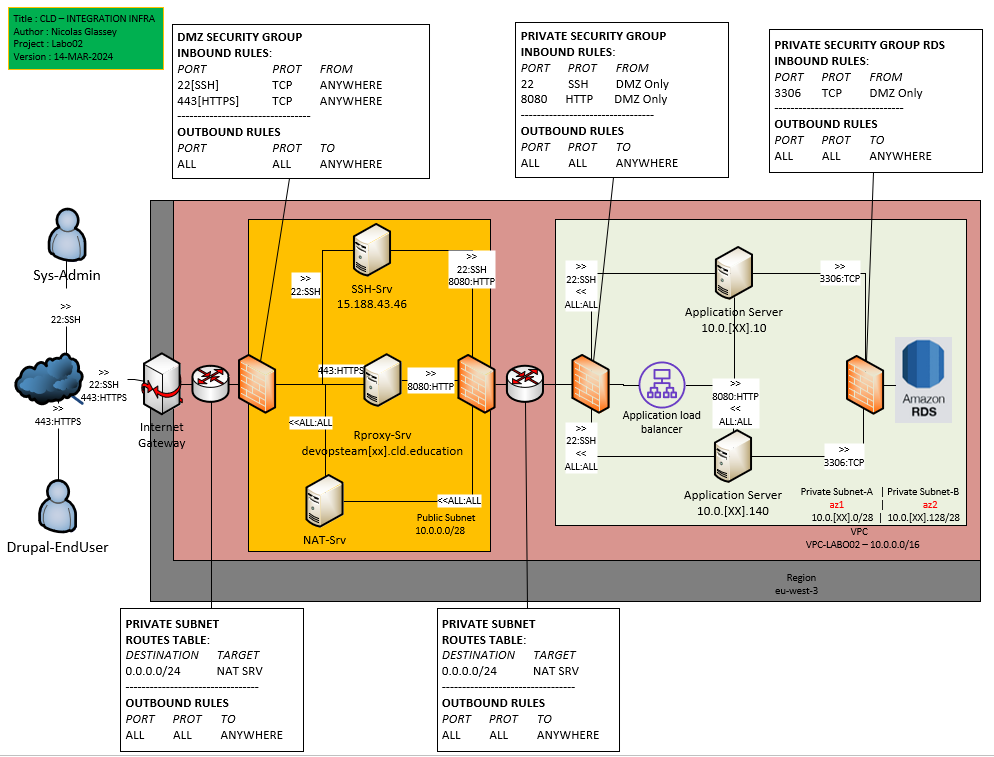

# Lab 03 : Autoscaling on IaaS

_Duration 2 periods_

## Pedagogical objectives

* Become familiar with a cloud service that automates the scaling of a
  web application

## Tasks

In this lab you will perform a number of tasks and document your
progress in a lab report. Each task specifies one or more deliverables
to be produced.  Collect all the deliverables in your lab report. Give
the lab report a structure that mimics the structure of this document.

This lab is a follow-on to the lab on app scaling on AWS. In this lab
you will make use of a cloud service (Auto Scaling Groups) that
automates the launching and termination of instances to elastically
respond to changes in user traffic.

### TODO

* [Task 001 - Configure Auto Scaling](001_ConfigureAutoScaling.md)
* [Task 002 - Test and validate the elasticity](002_TestAndValidateTheElasticity.md)