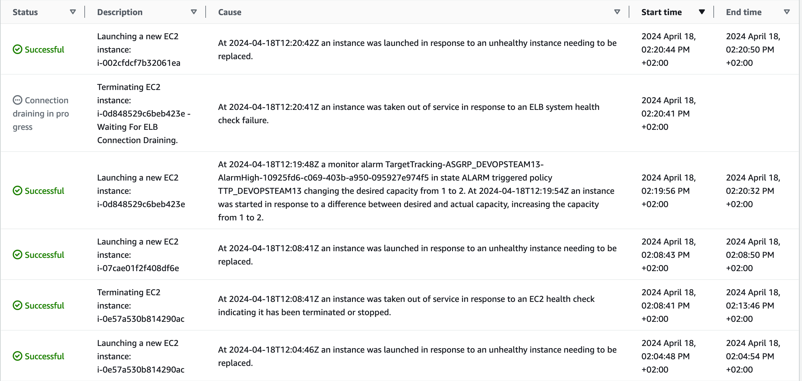

# Task 003 - Test and validate the elasticity


## Simulate heavy load to trigger a scaling action

* [Install the package "stress" on your Drupal instance](https://www.geeksforgeeks.org/linux-stress-command-with-examples/)

* [Install the package htop on your Drupal instance](https://www.geeksforgeeks.org/htop-command-in-linux-with-examples/)

* Check how many vCPU are available (with htop command)

```
[INPUT]
htop

[OUTPUT]
//copy the part representing vCPus, RAM and swap usage
    0[                                                        0.0%]   Tasks: 30, 410 thr; 1 running
    1[|                                                       0.7%]   Load average: 0.01 0.01 0.00 
  Mem[|||||||||||||||||||||||||||||||||||||||||||||||||||270M/951M]   Uptime: 01:56:51
  Swp[|                                                 3.00M/635M]
```


### Stress your instance

```
[INPUT]
//stress command
stress --cpu 2

[OUTPUT]
//copy the part representing vCPus, RAM and swap usage
//tip : use two ssh sessions....
    0[|||||||||||||||||||||||||||||||||100.0%]   Tasks: 33, 410 thr; 2 running
    1[|||||||||||||||||||||||||||||||||100.0%]   Load average: 0.16 0.03 0.01 
  Mem[||||||||||||||||||||||||||||||273M/951M]   Uptime: 02:46:27
  Swp[|                            1.75M/635M]

    PID USER      PRI  NI  VIRT   RES   SHR S CPU%▽MEM%   TIME+  Command
   1580 bitnami    20   0  3684    96     0 R 100.  0.0  0:09.40 stress --cpu 2
```

```
[INPUT]
//Screen shot from cloud watch metric
```
* (Scale-IN) Observe the autoscaling effect on your infa


[Sample](./img/CLD_AWS_CLOUDWATCH_CPU_METRICS.PNG)

```
//TODO screenshot of ec2 instances list (running state)
```


[Sample](./img/CLD_AWS_EC2_LIST.PNG)

```
//TODO Validate that the various instances have been distributed between the two available az.
[INPUT]
//aws cli command
// Query instances belonging to the autoscaling group ASGRP_DEVOPSTEAM13
aws ec2 describe-instances --filters "Name=tag:aws:autoscaling:groupName,Values=ASGRP_DEVOPSTEAM13" --query "Reservations[*].Instances[*].{Instance:InstanceId,AZ:Placement.AvailabilityZone}" --output table
[OUTPUT]

---------------------------------------
|          DescribeInstances          |
+-------------+-----------------------+
|     AZ      |       Instance        |
+-------------+-----------------------+
|  eu-west-3a |  i-0c344e28fc2a06c73  |
|  eu-west-3a |  i-090a276730a36dd18  |
|  eu-west-3a |  i-03bccf09dc3d8a6e1  |
|  eu-west-3a |  i-01dd1a22cc3e4bbca  |
|  eu-west-3a |  i-0e5cb47e53a8b1808  |
|  eu-west-3a |  i-07cae01f2f408df6e  |
|  eu-west-3a |  i-0ac943ba6e3e74b99  |
|  eu-west-3b |  i-002cfdcf7b32061ea  |
|  eu-west-3b |  i-0e0189eaa17062886  |
|  eu-west-3b |  i-0b115e9c0180cd01f  |
|  eu-west-3b |  i-0f8bd0b39f831fbb5  |
|  eu-west-3b |  i-06d4179da35cd6897  |
|  eu-west-3b |  i-0e57a530b814290ac  |
|  eu-west-3b |  i-0c524e222eeb81c00  |
|  eu-west-3b |  i-0592b89c38b1a21e9  |
|  eu-west-3b |  i-0d848529c6beb423e  |
|  eu-west-3b |  i-0e79b87984fa609f5  |
+-------------+-----------------------+
```

On observe les effets infructueux passés ^^

```
//TODO screenshot of the activity history
```
[Sample](./img/CLD_AWS_ASG_ACTIVITY_HISTORY.PNG)



```
//TODO screenshot of the cloud watch alarm target tracking
```
[Sample](./img/CLD_AWS_CLOUDWATCH_ALARMHIGH_STATS.PNG)


```

* (Scale-OUT) As soon as all 4 instances have started, end stress on the main machine.

[Change the default cooldown period](https://docs.aws.amazon.com/autoscaling/ec2/userguide/ec2-auto-scaling-scaling-cooldowns.html)

```
//TODO screenshot from cloud watch metric


//TODO screenshot of ec2 instances list (terminated state)


//TODO screenshot of the activity history
```

## Release Cloud resources

Once you have completed this lab release the cloud resources to avoid
unnecessary charges:

* Terminate the EC2 instances.
    * Make sure the attached EBS volumes are deleted as well.
* Delete the Auto Scaling group.
* Delete the Elastic Load Balancer.
* Delete the RDS instance.

(this last part does not need to be documented in your report.)

## Delivery

Inform your teacher of the deliverable on the repository (link to the commit to retrieve)